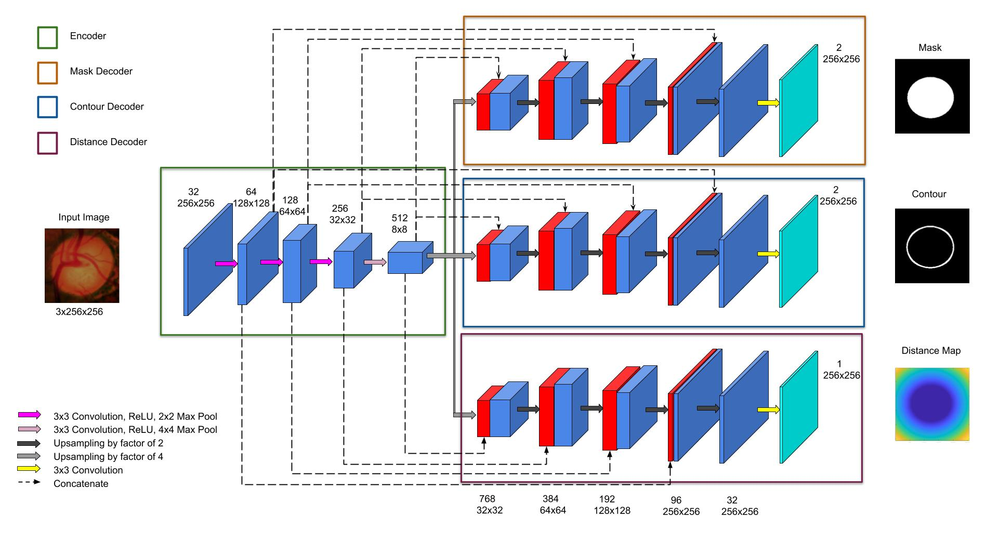
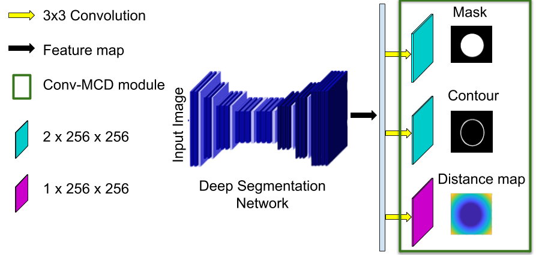

# Multi-task-deep-network
### *Multi-task deep learning based approaches for semantic segmentation in medical images* 
> [Psi-Net:  Shape  and  boundary  aware  joint  multi-task  deep  network  for medical  image  segmentation](https://arxiv.org/abs/1902.04099) (EMBC 2019) 

> [Conv-MCD: A Plug-and-Play Multi-task Module for Medical Image Segmentation](https://arxiv.org/abs/1908.05311) (MICCAIW - MLMI 2019)


## Dependencies
#### Packages
* *PyTorch*
* *TensorboardX*
* *OpenCV*
* *numpy*
* *tqdm*
 
An exhaustive list of packages used could be found in the *requirements.txt* file. Install the same using the following command:

```bash
 conda create --name <env> --file requirements.txt
```

#### Preprocessing
Contour and Distance Maps are pre-computed and can be obtained from binary mask. Sample matlab codes can be found here:

* Contour: https://in.mathworks.com/help/images/ref/bwperim.html
* Distance: https://in.mathworks.com/help/images/ref/bwdist.html


#### Directory Structure
Train and Test folders should contain the following structure:

```
├── contour
    |-- 1.png
    |-- 2.png
    ...
├── dist_contour
    |--1.mat 
    |--2.mat
    ...
├── dist_mask
    |-- 1.mat
    |-- 2.mat
    ...
├── dist_signed
    |-- 1.mat
    |-- 2.mat
    ...
├── image
    |-- 1.jpg
    |-- 2.jpg
    ...
└── mask
    |-- 1.png
    |-- 2.png
    ...
```
[//]: # (## Sample Results)

## Train code 
#### UNET
```bash
base_path=''
train_path=${base_path}'/train/image' 
val_path=${base_path}'/test/image' 
model_type='unet'
object_type='polyp'
save_path=${base_path}'/models'
python train.py --train_path ${train_path} 
                --val_path ${val_path} 
                --model_type ${model_type} 
                --object_type ${object_type} 
                --save_path ${save_path}
```
#### DCAN
```bash
base_path=''
train_path=${base_path}'/train/image' 
val_path=${base_path}'/test/image' 
model_type='convmcd'
object_type='dcan'
save_path=${base_path}'/models'
python train.py --train_path ${train_path} 
                --val_path ${val_path} 
                --model_type ${model_type} 
                --object_type ${object_type} 
                --save_path ${save_path}
```

#### DMTN
```bash
base_path=''
train_path=${base_path}'/train/image' 
val_path=${base_path}'/test/image' 
model_type='dmtn'
object_type='polyp'
save_path=${base_path}'/models'
python train.py --train_path ${train_path} 
                --val_path ${val_path} 
                --model_type ${model_type} 
                --object_type ${object_type} 
                --save_path ${save_path}
```

#### Psi-Net
```bash
base_path=''
train_path=${base_path}'/train/image' 
val_path=${base_path}'/test/image' 
model_type='psinet'
object_type='polyp'
save_path=${base_path}'/models'
python train.py --train_path ${train_path} 
                --val_path ${val_path} 
                --model_type ${model_type} 
                --object_type ${object_type} 
                --save_path ${save_path}
```

#### Conv-MCD
```bash
base_path=''
train_path=${base_path}'/train/image' 
val_path=${base_path}'/test/image' 
model_type='convmcd'
object_type='polyp'
save_path=${base_path}'/models'
python train.py --train_path ${train_path} 
                --val_path ${val_path} 
                --model_type ${model_type} 
                --object_type ${object_type} 
                --save_path ${save_path}
```


## Citations
If you use the Conv-MCD or Psi-Net code in your research, please consider citing the respective paper:
```
@article{Murugesan2019PsiNetSA,
  title={Psi-Net: Shape and boundary aware joint multi-task deep network for medical image segmentation},
  author={Balamurali Murugesan and Kaushik Sarveswaran and Sharath M. Shankaranarayana and Keerthi Ram and Mohanasankar Sivaprakasam},
  journal={ArXiv},
  year={2019},
  volume={abs/1902.04099}
}
```
```
@misc{murugesan2019convmcd,
    title={Conv-MCD: A Plug-and-Play Multi-task Module for Medical Image Segmentation},
    author={Balamurali Murugesan and Kaushik Sarveswaran and Sharath M Shankaranarayana and Keerthi Ram and Jayaraj Joseph and Mohanasankar Sivaprakasam},
    year={2019},
    eprint={1908.05311},
    archivePrefix={arXiv},
    primaryClass={cs.CV}
}
```
